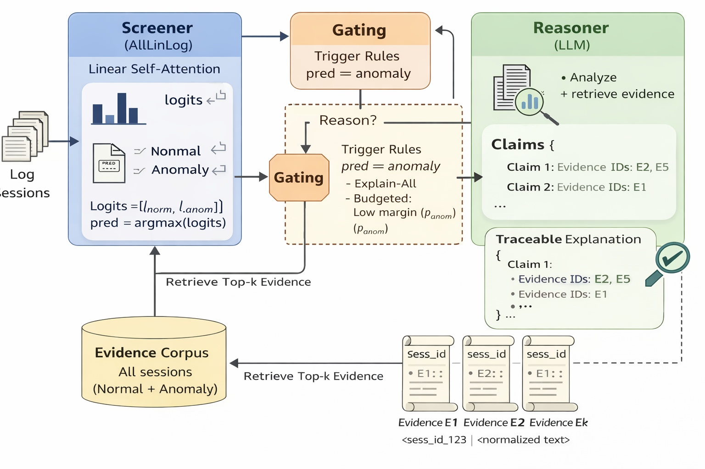

# Agentic Log-based Anomaly Detection（Screener–Reasoner）研究大綱與架構圖

> 目標：在 **維持 AllLinLog 高偵測效能** 的前提下，提供 **evidence-grounded（有證據鏈）** 的 **可追溯解釋**，並透過 gating 進一步做 **成本可控（cost-aware）** 的進階實驗。

---

## 一、研究動機與定位
- **既有成果**：AllLinLog（Linear Self-Attention Screener）在 BGL/HDFS 上偵測效能接近飽和（BGL≈0.999、HDFS≈0.997）。
- **新瓶頸**：accuracy 飽和後，實務痛點轉為「**為什麼異常**、**能否信任**、**能否追溯**」。
- **研究目標**：本研究不以提升 F1 為主，而是提供 **可追溯、可驗證的異常解釋**，並量化其成本/延遲影響。

---

## 二、研究問題（Research Questions）
- **RQ1（Traceable Explanation）**：在維持高偵測效能下，能否為異常 session 產出「可追溯、可驗證」的解釋？
- **RQ2（Evidence-grounded Faithfulness）**：透過檢索證據（RAG）+ 結構化輸出，能否提升解釋可信度、降低幻覺？
- **RQ3（Cost-Aware Trade-off）**：在固定 LLM 預算下（觸發率/成本限制），不同 gating 策略如何影響解釋品質與成本？

---

## 三、整體架構：Screener–Reasoner（Hybrid Agentic Explanation）
### 3.1 Screener（AllLinLog）
- 對所有 log sessions 做快速偵測  
- 輸出：normal/anomaly logits（與預測 label）

### 3.2 Reasoner（LLM 用於解釋，不做偵測）
- 僅對被選中的異常 sessions 啟動
- 目標：產出 **可追溯解釋**（每個 claim 都引用 evidence id）

### 3.3 Gating（成本/延遲控制器）
- 目的：決定哪些 anomalies 值得花 LLM 成本做解釋
- 實驗設計：
  - **Baseline：Explain-All**（所有 anomalous sessions 都解釋）
  - **進階：Budgeted Explain（margin gating）**（在預算內優先解釋低信心 anomalies）

---

## 四、RAG（Evidence Store 的建立與使用）
### 4.1 Evidence Corpus 的來源（可重現、可過審）
- 使用 **train split 的所有 sessions（normal + anomaly）** 建立 evidence store  
  - **不解釋 normal**，但 **保留 normal 作為對照 evidence**，提升 anomaly 解釋說服力
  - 避免只用 anomaly evidence 造成偏差（bias）

### 4.2 Retrieval（Top-k）
- 對每個要解釋的 anomaly session，取回 top-k 相似 evidence（k=5 作為起始）
- 用途：作為 LLM 解釋時的「可引用證據」

---

## 五、Trace Schema（可追溯解釋的輸出格式）
- LLM 必須輸出結構化格式（例如 JSON）：
  - `prediction`（可引用 Screener 結果）
  - `claims`（每個 claim 必須附 `evidence_ids`）
  - `optional: insufficient_evidence`

---

## 六、Baseline 與進階實驗設計
### 6.1 Baseline：Explain-All + RAG + Trace Schema
- 觸發：predicted anomaly → 一律解釋
- 目的：先做出穩定的可追溯解釋能力與品質評估

### 6.2 進階：Budgeted Explain（Cost-aware agentic explanation）
- 固定 LLM 預算（最多解釋前 K% anomalies 或每天最多 M 次）
- gating：依 logits margin（低信心優先）選擇要解釋的 anomalies
- 目的：展示「成本–品質」trade-off

---

## 七、評估指標（不只 F1）
### 7.1 Detection（基本盤）
- F1 / Precision / Recall（Screener）

### 7.2 Explanation Quality（核心貢獻）
- **Evidence coverage**：claim 是否都有 evidence id（目標接近 100%）
- **Faithfulness / support rate**：claim 是否被 evidence 支持（抽樣人工或規則檢查）

### 7.3 Cost & Latency（agentic/cost-aware 必備）
- Trigger rate（解釋觸發率）
- Avg tokens per explained session
- Avg / P95 latency
- Top-k 對成本與品質的影響（ablation）

---

## 八、論文貢獻點（Contributions）
- 提出以 AllLinLog 為 Screener、LLM 為 Reasoner 的混合式流程，聚焦於「可追溯解釋」而非再追 F1。
- 建立 evidence-grounded explanation：RAG + trace schema，使解釋可追溯、可驗證。
- 提出 cost-aware 的 gating 實驗設計（Explain-All baseline + Budgeted Explain），量化成本–品質權衡。

---

## 九、架構圖
> 圖檔另附（下載連結如下）。

---
